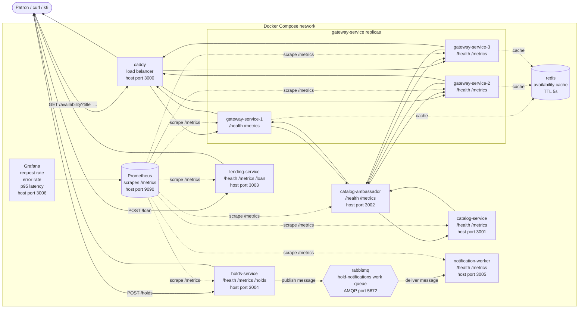

# Services List

* Team target: at least 4 custom services (3 members + 1 additional/shared service)

**catalog-service (shared):** Manages inventory and handles book and digital resource search and availability information across branches.

**holds-service (Grace):** Manages hold requests and queue position for patrons. After a hold is saved, this service publishes a message to the `hold-notifications` RabbitMQ work queue.

**lending-service (Erik):** Coordinates resource check-outs and handles active loans, due dates, and returns.

**gateway-service (Bhawna):** Routes incoming patron requests and aggregates availability information across branches.

**notification-worker (shared, Sprint 4):** Consumes messages from the `hold-notifications` RabbitMQ work queue and processes hold notifications asynchronously.

# Diagram

