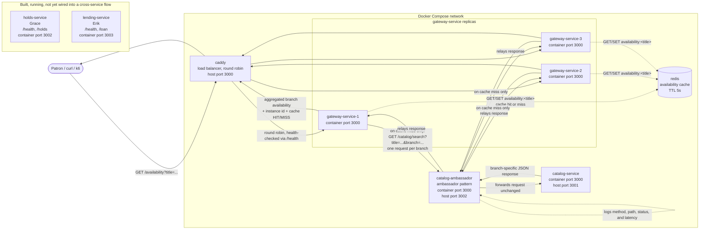

# Services List
- Team target: 4 services (3 members + 1 shared)

catalog-service (shared): Manages inventory, handles book and digital resource search and availability info across branches. 
This is what a patron hits when they're browsing or checking if something is available and where. 

holds-service (Grace): Manages hold requests and queue position for patrons waiting on an item that's currently checked out somewhere else.

lending-service (Erik): Coordinates queries for resource check-outs, as well as updates regarding active loans, due-by dates, and returns.

gateway-service (Bhawna): Routes incoming patron requests to the right branch or service and aggregates availability info across branches into one response.
***
This is our first pass based on the domain (catalog browsing, holds, digital lending, and cross branch coordination). Ownership may shift slightly and scope will get more specific as we learn more patterns in later sprints.

# Diagram 

Sprint 3 adds two things on top of the Sprint 2 picture: `gateway-service`
is now three replicas behind Caddy (load balancing, the "replicated
service" pattern), and `/availability` is cached in Redis so repeat
lookups for the same title skip the branch fan-out entirely.

This diagram also fixes a gap from Sprint 2: `holds-service` and
`lending-service` exist in the repo with working code and their own
`/health` endpoints, but neither is wired into `docker-compose.yml` or
into the gateway's request flow yet. They're shown below as real,
independently running services rather than left off the diagram or
drawn as connected to something they aren't actually connected to yet.
Wiring them into cross-service flows is expected in a later sprint.

