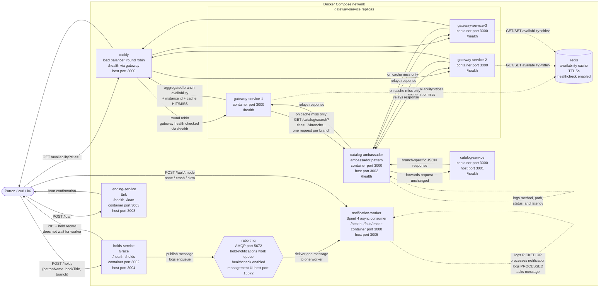

# Services List

* Team target: at least 4 custom services (3 members + 1 additional/shared service)

**catalog-service (shared):** Manages inventory and handles book and digital resource search and availability information across branches. This is what a patron uses when browsing or checking whether an item is available and where.

**holds-service (Grace):** Manages hold requests and queue position for patrons waiting on an item that is currently checked out. After a hold is saved, this service publishes a message to the `hold-notifications` RabbitMQ work queue.

**lending-service (Erik):** Coordinates resource check-outs and handles information about active loans, due dates, and returns.

**gateway-service (Bhawna):** Routes incoming patron requests to the appropriate service and aggregates availability information across branches into one response.

**notification-worker (shared, Sprint 4):** Standalone consumer of the `hold-notifications` RabbitMQ work queue. It picks up each hold notification created by `holds-service`, simulates sending a confirmation to the patron, and acknowledges the message after processing. It exposes `/health` and an admin `/fault/:mode` endpoint with `none`, `crash`, and `slow` modes for the Sprint 4 failure scenario.

---

This is our current service structure based on the library domain, including catalog browsing, holds, digital lending, cross-branch coordination, caching, and asynchronous notification processing.

# Diagram

