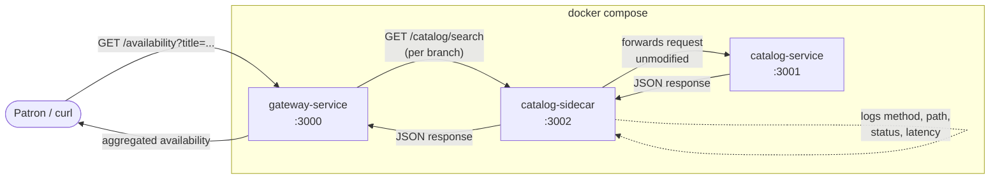

# Services List
- Team target: 4 services (3 members + 1 shared)

catalog-service (shared): Manages inventory, handles book and digital resource search and availability info across branches. 
This is what a patron hits when they're browsing or checking if something is available and where. 

holds-service (Grace): Manages hold requests and queue position for patrons waiting on an item that's currently checked out somewhere else.

lending-service (Erik): Coordinates queries for resource check-outs, as well as updates regarding active loans, due-by dates, and returns.

gateway-service (Bhawna): Routes incoming patron requests to the right branch or service and aggregates availability info across branches into one response.
***
This is our first pass based on the domain (catalog browsing, holds, digital lending, and cross branch coordination). Ownership may shift slightly and scope will get more specific as we learn more patterns in later sprints.

# Diagram 

Ideas while making: A patron sends a book title to the gateway service’s `/availability` endpoint. The gateway checks each branch through the catalog sidecar, which forwards requests to the catalog service, logs request details and latency, and returns the responses. The catalog service is unaware of the sidecar. The gateway then combines all branch results into one response.

.

